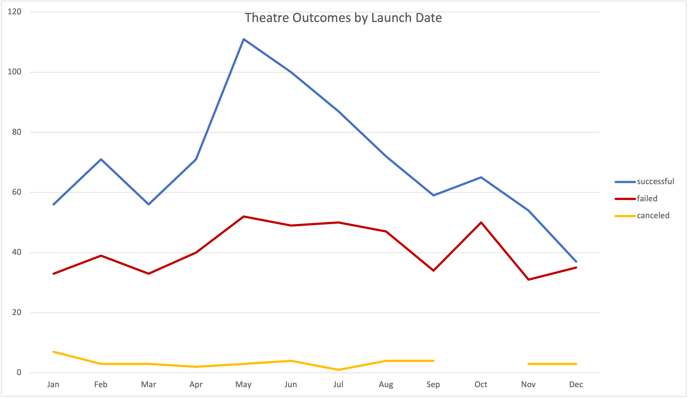
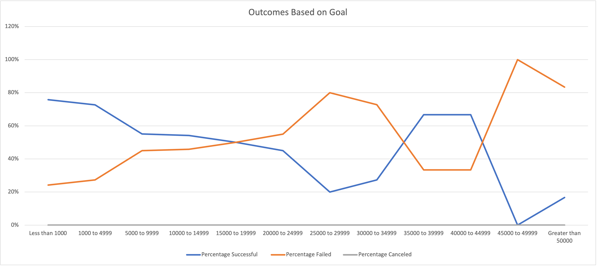

# Kickstarting with Excel

## Overview of Project

Provided in the Data Set is a collection of data about kickstarters from around the world. Our client Louise’s play Fever is moving towards its goal. The areas of interest to us in this analysis are the outcomes, launch dates, of the category theaters. 

### Purpose

 The purpose of this project was to provide analysis of how theatre kickstarters' goals were related to their outcomes, as well as how kickstarter’s launch dates were related to their outcomes. 
 

## Analysis and Challenges

 Analysis was done through pivot tables to plot the amount of successful, failed, and canceled theatre projects by month.   

Additionally, COUNTIFS() were used to segment theatre kickstarter outcomes by various increments of goal amount in a table. COUNTIFS() posed a challenge as I was realtively unfamilar with them, and typically prefer using COUNTIF() with AND()'s or OR()'s. However, now that I have experience with them I understand their value.  

Both of these tables were visualized in line graphs that are provided below.  

### Analysis of Outcomes Based on Launch Date

* 
 Through my analysis, I was able to find that theatre kickstarters had the most amount of successful outcomes when launched in May, followed by June (100) and July (87). Successful Theatre Kickstarters also had a range of 37 to 111.   
* By comparison, failed and canceled startup results were relatively flat, with ranges of 31 to 52 and 1 to 7, respectively. These insights would allow me to suggest to Louise that launching her kick starter between the months of May and July would give her the best chance of successfully launching her play. 

## Analysis of Outcomes Based on Goals

* 
Not surprisingly, we found that the highest success rates were associated with the lowest goals, and the highest failure rates were associated with the lowest goals. With that being said, there appears to be a sweet spot of $30,000 to $49,999 dollars where 67% of theatre kickstarters are successful. This could be a good goal budget as to not compromise the financial strength of the project, while also having a realistic expectation for success. 

## Challenges and Difficulties Encountered 

#### COUNTIF()
* 
In all honesty, my experience with Excel made this project relatively simple. With the exception of a small hiccup with COUNTIFS(). After setting up my formulas I double checked my count of successful, failed, and canceled kickstarters with a pivot table. I found that my numbers were off. It wasn’t until I watched the “hint” video that I realized that I was using a less than or equals to formula for the “less than $1000”. It was a fairly obvious mistake, and just due to an oversight on my part.  

#### README and GitHub

* Through office hours with our TAs I was able to figure out how to embed images easily into the README.md. They also shared some helpful resources for markdown best practices, and it proved to be relatively simple.  

* Of course, at the time of writing this I have yet to upload this to my GitHub repository so I may have some challenges there. But I’m not all that worried about it. 

## Results

- What are two conclusions you can draw about the Outcomes based on Launch Date?
  * 
Firstly, I would conclude that launching a theater kickstarter in the Months of May, June, and July would be the most probable route for success.   
  * Secondly, because the failed and canceled rate is so flat throughout the year, there is probably another variable that is impacting why these theater kickstarters are not successful outside of when they were launched. So while the highest count of successful launches happen between May and July, it might not be a causal relationship.
  

- What can you conclude about the Outcomes based on Goals?
  * 
 I can conclude that the higher the goal amount is, the lower the chance of success. Conversely, the lower the goal amount is, the higher the chance of success. However, there appears to be a sweet spot of $30,000 to $49,999 dollars where 67% of theater kickstarters are successful.

- What are some limitations of this dataset?
  * 
 There is almost no data for canceled projects, so it makes drawing conclusions impossible. I also feel like looking at launch date doesn’t exactly give us the best insights into casual relationships towards outcome. Looking at quarters might be more useful because it has the context of a business cycle. 

- What are some other possible tables and/or graphs that we could create?
  * 
 I’m really interested in seeing the relationship between the number of backers and outcomes. This could inform fundraising decisions such as trying to find one angel investor, or going down a more grassroots direction. Also as I mentioned earlier, looking at financial quarters vs outcomes could be more useful. 

